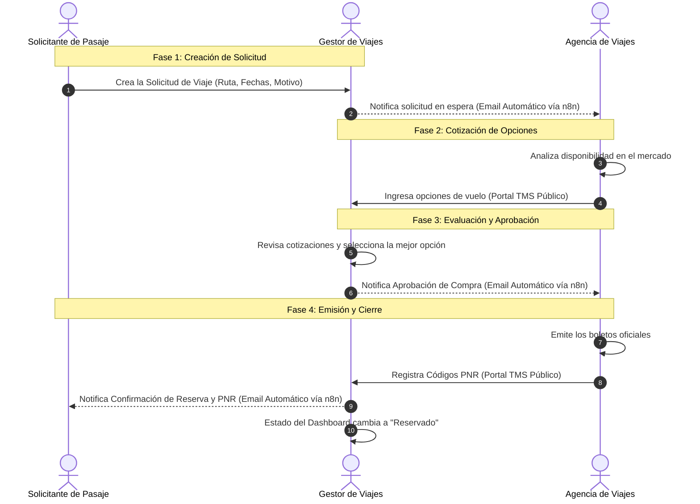

# Flujo Operativo: FARMEX Travel Management System (TMS)

Este documento detalla el ciclo de vida completo de una solicitud de pasaje en el aplicativo corporativo FARMEX TMS. Está diseñado para entender fácilmente la secuencia operativa, visualizar a los actores involucrados y servir como base documentaria para presentaciones de alto nivel.

---

## 👥 Actores del Sistema

El sistema ha sido estructurado para agilizar la interacción entre tres actores principales:

1. **🧑‍💼 Solicitante de Pasajes (Empleado):** El colaborador de FARMEX que necesita viajar por motivos de negocio y realiza la solicitud formal.
2. **🛡️ Gestor de Viajes (Administración):** El responsable interno en FARMEX encargado de revisar solicitudes, gestionar presupuestos, elegir cotizaciones y autorizar las compras.
3. **🏢 Agencia de Viajes (Proveedor Externo):** El socio estratégico encargado de buscar las mejores tarifas, proponer opciones de vuelo y emitir los boletos finales.

---

## 🔄 Diagrama de Flujo (Secuencia Visual)

El siguiente diagrama ilustra el recorrido automatizado desde que nace la necesidad de viaje hasta la confirmación de la emisión del pasaje.

---

## 🗺️ Descripción Paso a Paso del Proceso

A continuación, se detalla qué hace exactamente cada usuario y cómo reacciona el sistema operativo en cada etapa.

### 📍 Fase 1: Creación de la Solicitud (El Inicio)
1. **El Solicitante** inicia sesión en su Panel de Control (Dashboard) del TMS.
2. Llena un formulario detallando su requerimiento: *Ruta (Origen y Destino), tipo de trayecto (Solo Ida o Ida/Vuelta), fechas y la justificación del viaje.*
3. **El Sistema** registra la solicitud con estado **Pendiente** y dispara una alerta automática (n8n) por correo electrónico a la Agencia de Viajes.
   * *El correo enviado a la Agencia incluye un botón directo y encriptado hacia el "Portal Cotizador Público" vinculado a esa solicitud puntual.*

### 📍 Fase 2: Recepción de Cotizaciones (Costeo)
4. **La Agencia de Viajes** revisa el correo y hace clic en el enlace seguro.
5. Accede a un portal web especial que no requiere credenciales administrativas. Allí visualiza la ruta requerida e ingresa múltiples opciones de vuelo (hasta 3 alternativas).
6. Por cada opción ingresada, indica: *Aerolínea, N° de Vuelo y Precio total (Tarifa USD).*
7. **El Sistema** actualiza silenciosamente la base de datos para que el Gestor pueda ver los nuevos prospectos.

### 📍 Fase 3: Toma de Decisión y Compra (Autorización)
8. **El Gestor de Viajes** accede a la Vista Administrativa del TMS. 
9. Encuentra la solicitud en su lista de tareas y despliega las cotizaciones enviadas por la Agencia.
10. Compara precios y horarios. Una vez elegida la mejor opción, marca la casilla correspondiente y confirma la selección (Botón *Aprobar Cotización Seleccionada*).
11. **El Sistema** cambia el estado a **Aprobado** y dispara un correo dinámico a la Agencia de Viajes informando: *"FARMEX ha aprobado la compra, procede con la emisión de boletos"*.
    * *En este correo se anexa otro botón de ingreso seguro para el registro final.*

### 📍 Fase 4: Emisión de Boletos (Cierre de Reserva)
12. **La Agencia de Viajes** recibe el aviso, compra los pasajes en su sistema central (GDS/Aerolínea) y hace clic en el enlace del último correo.
13. Accede al último formulario oficial donde **solo se le exige ingresar los Códigos de Reserva PNR** de los vuelos aprobados.
14. Al pulsar aceptar, el flujo externo culmina de forma exitosa.

### 📍 Fase 5: Notificación Final al Empleado (Misión Cumplida)
15. **El Sistema** cambia el estado general de la solicitud a **Reservado** (Completada).
16. Un último nodo maestro (n8n) redacta y despacha el correo transaccional final dirigido directamente al correo personal corporativo del **Solicitante**. Este correo contiene:
    * El itinerario final (Ruta desglosada y fechas mapeadas mes a mes).
    * Los Códigos PNR resaltados para poder hacer el Chek-in web.
    * Un aviso imperativo recordando llegar al aeropuerto con una hora de anticipación mínima.
17. Automáticamente, el Dashboard del Solicitante muestra el viaje como "Reservado" exhibiendo orgullosamente los Códigos PNR asignados.

---

> [!TIP]
> **Nota para Presentaciones:**
> Puedes copiar y pegar el código del diagrama `mermaid` directamente en herramientas como **Notion**, **GitHub**, o renderizarlo como una imagen gratuita usando el portal web oficial **[Mermaid Live Editor](https://mermaid.live/)** para exportarlo como PNG de alta calidad y adjuntarlo a tus diapositivas institucionales.
